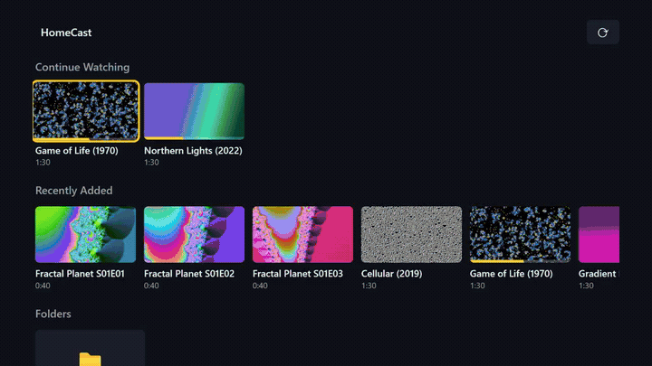
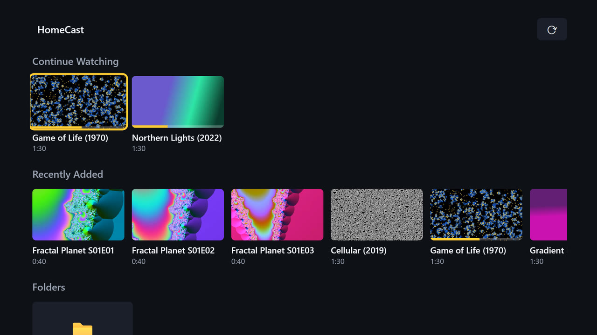
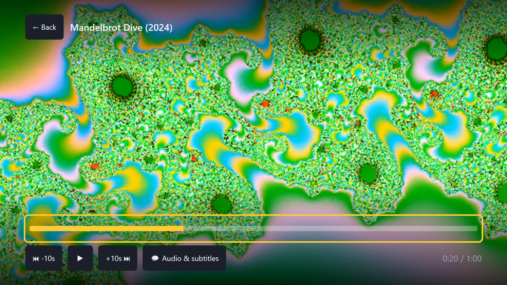
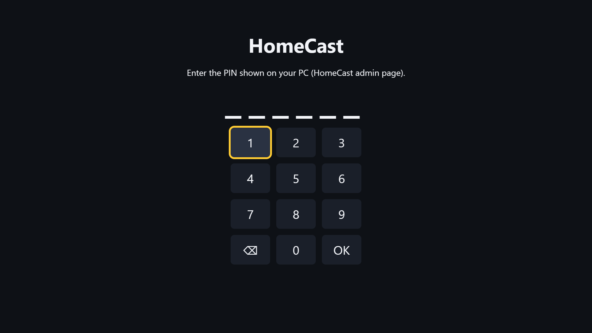
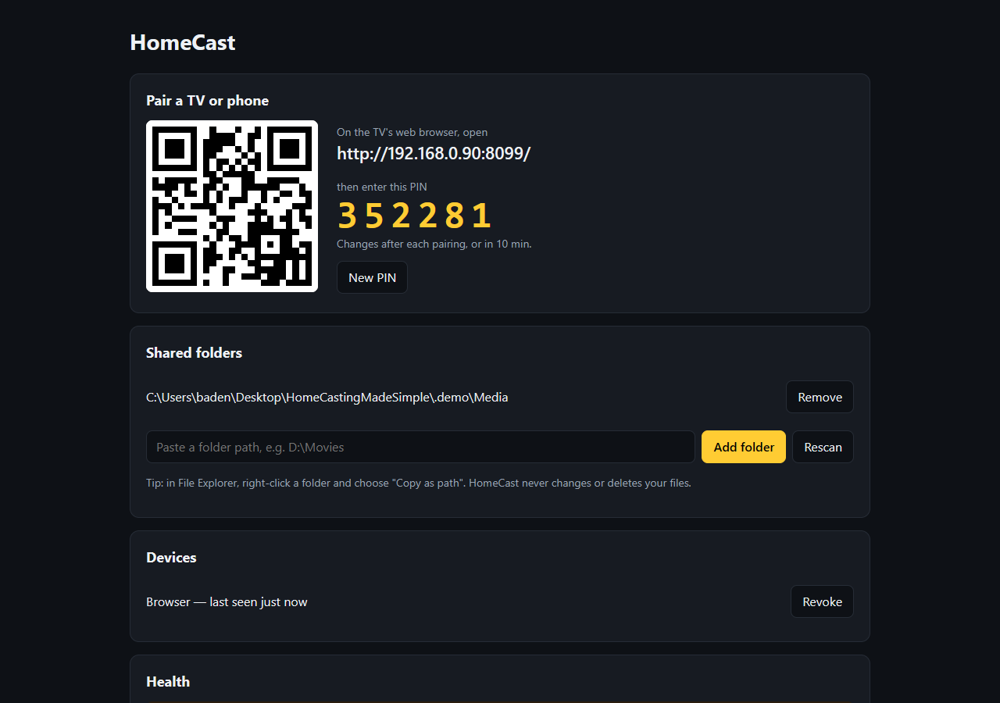
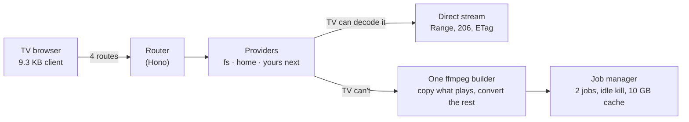

<div align="center">

# HomeCast

**Your PC's movies, music and photos on your TV's web browser. One exe. No server, no account, no cloud.**

[](https://github.com/bully911210/homecast/actions/workflows/ci.yml)
[](https://github.com/bully911210/homecast/releases/latest)
[](LICENSE)




<sub>Remote-only navigation at 1920x1080. The demo library is generated with ffmpeg, so every frame here is reproducible.</sub>

### [⬇ Download for Windows](https://github.com/bully911210/homecast/releases/latest/download/HomeCast-win-x64.zip)

</div>

## Three steps

1. **Unzip and run** `homecast.exe`. When Windows Firewall asks, tick **Private networks** only.
2. **Add a folder.** The admin page opens in your browser. Paste a path like `D:\Movies` and click **Add folder**.
3. **Open the address on your TV's browser** (or scan the QR code with your phone) and type the 6-digit PIN once.

That's it. Browse with the remote, a pointer remote or a mouse.

## What you get

| | |
|---|---|
|  |  |
| **Continue Watching and Recently Added**, resume where you stopped, on every TV in the house | **Plays almost anything.** Files the TV can't decode are converted on the fly, on your GPU when you have one |
|  |  |
| **Pair once with a PIN.** No accounts, no passwords, devices you can revoke | **One admin page** on the PC: folders, devices, health warnings, start with Windows |

- **Direct play** for MP4 and WebM the TV can decode, with full seeking.
- **Smart conversion** for everything else (MKV, HEVC, AV1, DTS, AC3...). Video and audio are decided separately, so an MKV with DTS only has its audio converted. NVENC, Quick Sync or AMF when available, otherwise libx264.
- **Subtitles:** sidecar `.srt`/`.vtt` and embedded text tracks. **Audio track** switching.
- **Photos** full screen with next and previous. **Music** with the same player.
- **Remote, pointer or mouse:** arrow keys, OK, Back (Samsung and LG keys mapped), hover to focus, click to play, click the bar to seek.
- **Tray light:** green while HomeCast answers, red when it doesn't.

## Is it safe to run?

It opens a port on your PC, so here is exactly what guards it:

- **Home network only.** Requests from outside private address ranges are refused before anything else runs.
- **DNS rebinding blocked** with a Host header allowlist, and cross-site writes refused.
- **PIN pairing.** Each TV gets a random 256-bit token. Only its SHA-256 hash is stored. Revoke any device from the admin page.
- **Folder jail.** The TV never sends a file path. Every path is resolved and checked to sit inside a folder you shared (29 traversal and 12 hostile-request cases in the tests).
- **Read-only.** HomeCast never changes or deletes your media. Its own data lives in `%LOCALAPPDATA%\HomeCast`.
- **The admin page only answers on the PC itself.**

The exe isn't code-signed yet, so SmartScreen asks once ("More info", then "Run anyway"). Each release lists its SHA-256 so you can check the download.

## How it works



**Everything is an Item. Providers create Items. The TV renders Items by kind.** A new source, such as an IPTV playlist or a webcam, is one provider file: no new screen, no new endpoint. The full design is one page: [docs/ARCHITECTURE.md](docs/ARCHITECTURE.md). Every dependency and trade-off is one line in [docs/DECISIONS.md](docs/DECISIONS.md).

Built with one rule: before adding anything, ask whether the platform already does it, whether something existing can be reused, or whether the requirement can go. That's why there's no framework on the TV, no image library (ffmpeg makes the thumbnails), no installer and no Electron tray.

## When to use something else

HomeCast plays your files on your home network, fast, with nothing to set up. If you want posters and metadata scraped from the internet, streaming outside the house, or user accounts, a full media server like Jellyfin or Plex is the better tool.

## FAQ

<details><summary><b>Which TVs work?</b></summary>

Any TV, phone or tablet with a reasonably modern web browser (Chromium 69 era or newer). Samsung (Tizen) and LG (webOS) remote keys are mapped, including Back. Tested so far in desktop Chrome and Edge. Please [open an issue](https://github.com/bully911210/homecast/issues/new) with your TV model and what happened: real TV reports are the most useful contribution right now.
</details>

<details><summary><b>The TV can't connect.</b></summary>

Windows probably treats your network as Public. Set it to Private in Settings, Network & internet, your Wi-Fi or Ethernet, Network profile type. The admin page's Health section tells you when this is the problem.
</details>

<details><summary><b>Does it need a powerful PC?</b></summary>

Only for conversion. Files the TV can play directly cost almost nothing. Conversion uses the GPU encoder when there is one; at most 2 run at once.
</details>

<details><summary><b>How do I uninstall?</b></summary>

Untick "Start HomeCast when I sign in", quit from the tray, delete the folder and `%LOCALAPPDATA%\HomeCast`.
</details>

## Build from source

Node 24+, Windows or Linux. Google Chrome is needed for the browser tests (Chromium builds lack H.264).

```bash
npm ci
npm run dev        # builds the TV client and starts on :8096
npm test           # 207 unit and integration tests, generates test media with ffmpeg
npm run e2e        # Playwright: the whole flow with the remote only, then the mouse only
npm run package    # Windows: dist/HomeCast-win-x64.zip
```

Contributions are welcome, especially new providers and TV reports. Start with [docs/ARCHITECTURE.md](docs/ARCHITECTURE.md).

If HomeCast saved you a server install, a star helps other people find it.

## License

MIT, see [LICENSE](LICENSE). The release zip includes ffmpeg and ffprobe binaries, which are GPL-licensed; see [THIRD-PARTY.md](THIRD-PARTY.md) for their licences and source.
